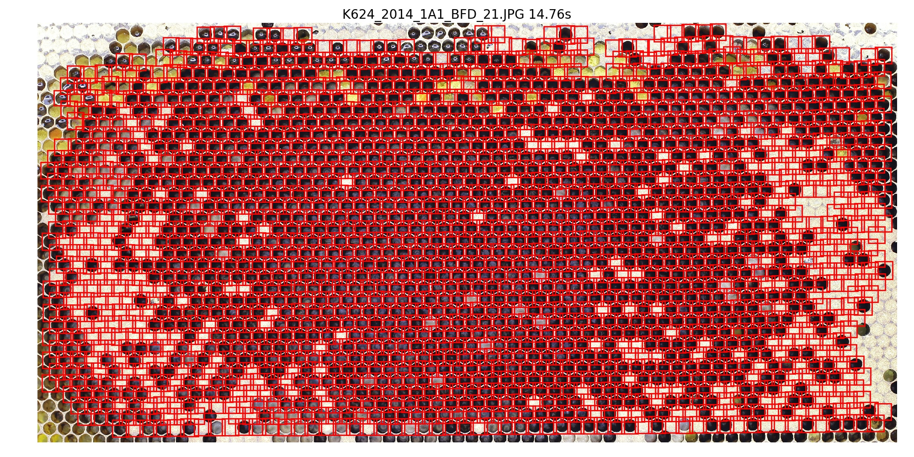
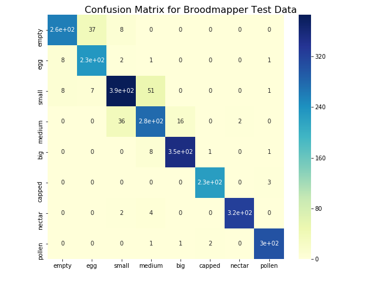

# Beehive

This is a side-project I was working on a few years ago.
Within a few weeks I created an algorithm that can take pictures of honeycombs
and find out how many cells of each type are on it: small/medium/big larvae, capped/empty cells, cells with eggs/nectar/pollen.

I splitted the task into 2 problems. First, segment the whole honeycomb
picture into small pictures of each cell.
Then classify each cell based on its small picture.

- [segmentation](./segmentation) a segmentation algorithm using _classic_ computer vision
- [classification](./classification) a convolutional neural net for classification

My results are ok: >80% accuracy in both detecting cells and classifying them.
However, if you are reading this now I would recommend [DeepBee](https://avsthiago.github.io/DeepBee/).
They essentially did the same, but their results are much better.
If their code would have been public earlier, I probably would have just used **DeepBee**.

