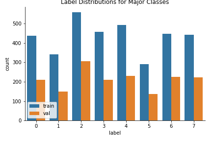
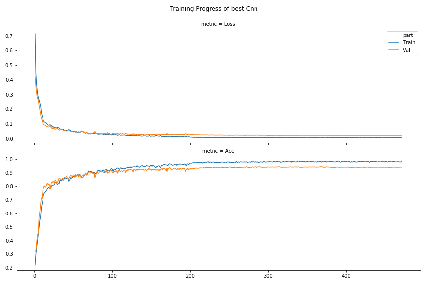
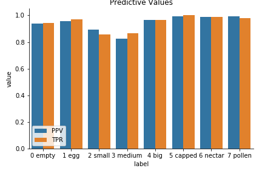

# Major Classes

#### Idea

**Exclude underrepresented classes**, deal with them in another model.
They are: _10 unknown_, _6 hatching_, _dead 9_.
_unknown_ and _hatching_ are not really interesting and they are super rare.
_dead_ is really interesting but it is still heavily underrepresented.

#### Procedure

So here, I only predict the remaining 8 classes.
The dataset is prepared in [prepare_features.py](./prepare_features.py).
In [training.py](./training.py) the training is delegated.
It is a random search through the hyperparameter space.
Models (the best of each round) are saved under [models/](./models),
the training progress under [training/](./training/).
Although after evaluation I will only keep the files for the best model.
A summary for each round is in [results.csv](./results.csv).
The evaluation is done in [evaluation.py](./evaluation.py).

```
# from repo root dir
python3 major_classes/prepare_features.py
python3 major_classes/training.py
python3 major_classes/evaluation.py
```

#### Pre-Processing

Classes _empty_ and _clear_ were merged.
As mentioned above, classes _unknown_, _hatching_, _dead_ were omitted.
$1/3$ of the data is **test**.
From the remaining $2/3$ the **test:val** split is 2:1.
Test data is not shown directly during training, but instead
transformations are shown which were identified in
[preprocessing/](../preprocessing/).



## Training

Training is orchestrated from
[major_classes/training.py](./training.py).
It is a random search through varying _models_, _losses_, _starting learning rates_, _batch sizes_, and _dropout rates_.
10 rounds were run.
The actual training procedure for a single round is defined in
[utils/train.py](../utils/train.py).
Models are evaluated by validation accuracy.

Models are defined in [utils/models.py](../utils/models.py).
`simpleCNN` sticks roughly to an example from the
[Keras docs](https://keras.io/examples/cifar10_cnn/).
Only some adjustments were made.

- bit larger filter (`(5, 5)`, instead of `(3, 3)`) in first layer because my images are 150x150.
- stepwise learning rate reduction
- Adam optimizer
- early stopping
- different losses
- different batch sizes
- different starting learning rates

The other models `deepCNN` and `smallCNN` are a larger and a smaller variant of that model respectively.
The best model was a `deepCNN`.
The training progress is shown below.
Although it turned out that the most important factor was the starting learning rate
which had to be at $10^{-3}$ for good results.
The best loss for this model was reached at 271 epochs.



## Evalutation

On the test dataset the model had **94%** accuracy.
Like in previous approaches it only had difficulties distinguishing _small_ and _medium larva_, and _empty_ and _small larva_.
Seems reasonable, they are actually hard to distinguish.


Predictive values are shown below.
For the most part recall and the positive predictive value are over 93%.
Only _small_ and _medium larva_ predictions have values below 90%, the lowest being the positive predictive value for _medium larva_ with 83%.


