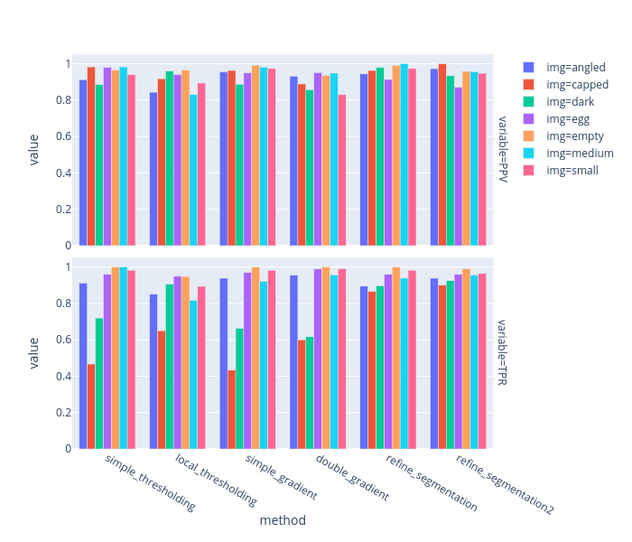

# Honeycomb Segmentation

Trying to extract all cells from honeycomb pictures:

- [simple_thresholding](./simple_thresholding/) relying on Otsu
- [local_thresholding](./simple_thresholding/) local histogram generalization before Otsu
- [simple_gradient](./simple_gradient/) thresholded labels from image gradient
- [double_gradient](./double_gradient/) consolidated segmentation based on 2 thresholded sets of labels from image gradient
- [refine_segmentation](./refine_segmentation/) initial segmentation gets iteratively refined by using the honeycomb pattern

Under [test](./test/) I'm applying the best method on new images.

The resulting segmentation was quite slow on large images.
My efforts to optimize the algorithm are under [optimization](./optimization).

I noticed how different the extracted segments in new images look compared to broodmapper images.
Therefore, I decided to manually label images for optimizing the cell classifier.
Under [test/segments/](./test/segments/) I extracted and labeled honeycomb segments.
They are in turn used by the classifier.
