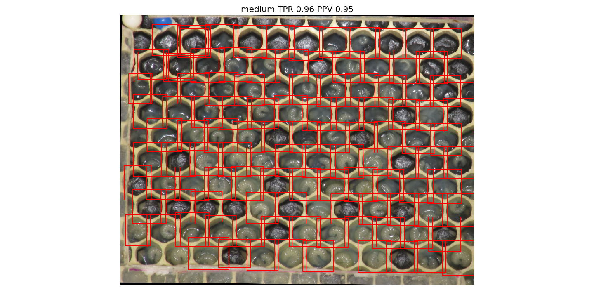
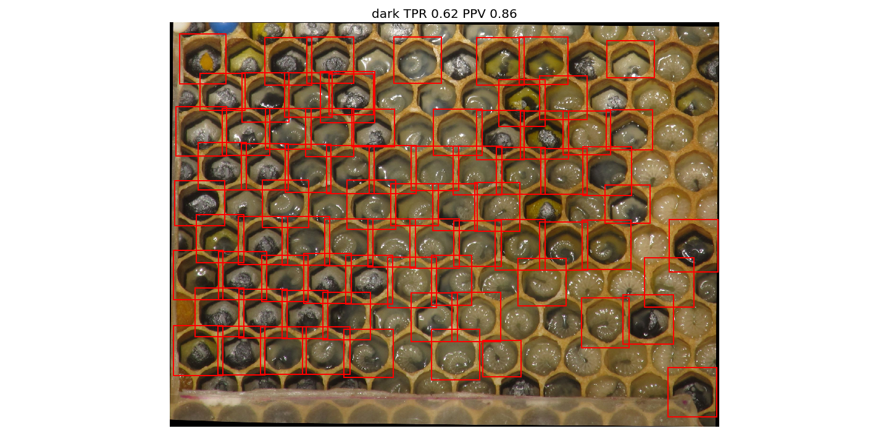
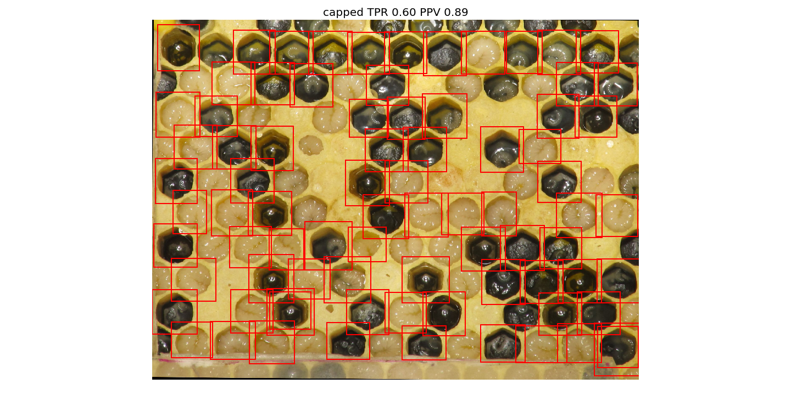

# Double Gradient

Here, the image gradient is computed and and thresholded as in simple gradient.
But here 2 threshlolds are used.
The first is found by Otsu.
Then the image is filtered for values below the first threshold and Otsu is applied again.
One set of labels is created for gradients above the first threshold.
A second set is created for gradients below the first but above the second threshold.
Both sets of labels are skeletonized indepentently so they don't overlap.

From the union of labels regions are extracted as in the methods before.
Here, the problem arises that several regions are captured multiple times.
So, each region is compared to other regions.
If 2 regions overlap more than 70% they are grouped.
Out of every group of regions only the biggest is chosen.
On _normal_ images this works well:

On _dark_ images it also seems to work:

The main goal was to get better on the _capped_ image.
Indeed the method is a better, but only slightly.
A lot of seemingly obvious big larva are not identified.

## Validation

For validation I use some images which I randomly picked from broodmapper.com
(under [../data/broodmapper/](../data/broodmapper)).
All cells in the honeycomb images are labeled by hand.
The validation algorithm checks whether each labeled cell is fully captured by
a segment of the segmentation.
From that TPR and PPV are calculated.
This is done in [test_procedure.py](./test_procedure.py), segmentations are shown
in [segmentations/](./segmentations/), statistics are in [results.json](./results.json).
