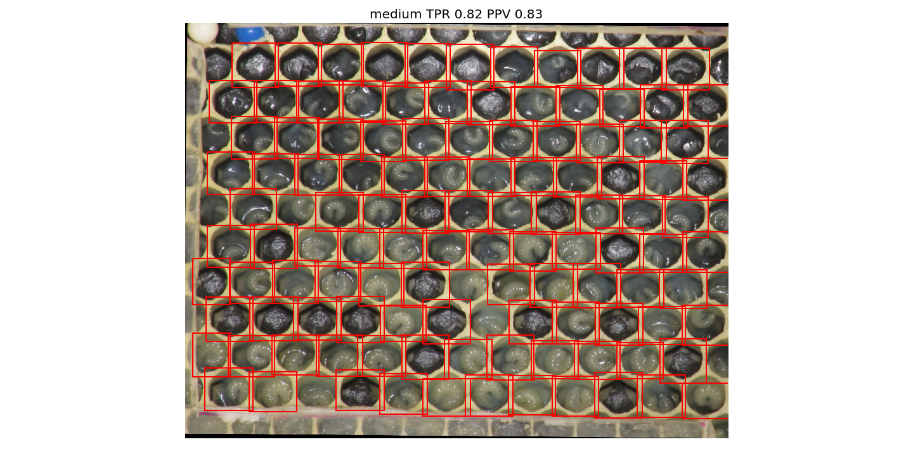
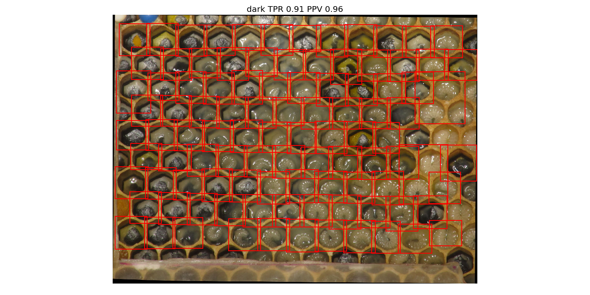
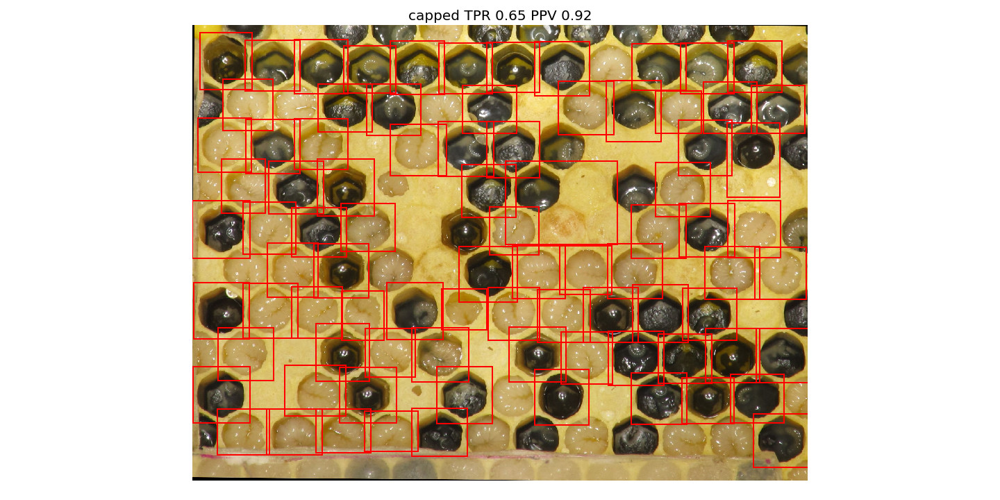

# Local Thresholding

Almost the same as _simple thresholding_ just that I use local histogram generalization before applying Otsu.
The procedure is in [procedure.py](./procedure.py).

As _simple thresholding_ normal honeycombs work fine.

The main problem was always identifying cells in an image with a lot of _capped_ cells; especially big larva.
Here this is still bad but a little bit better than in _simple thresholding_.

## Validation

For validation I use some images which I randomly picked from broodmapper.com
(under [../data/broodmapper/](../data/broodmapper)).
All cells in the honeycomb images are labeled by hand.
The validation algorithm checks whether each labeled cell is fully captured by
a segment of the segmentation.
From that TPR and PPV are calculated.
This is done in [test_procedure.py](./test_procedure.py), segmentations are shown
in [segmentations/](./segmentations/), statistics are in [results.json](./results.json).
