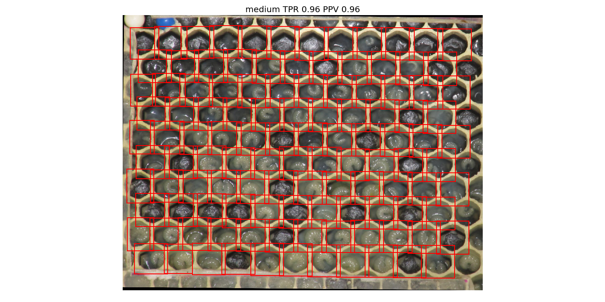
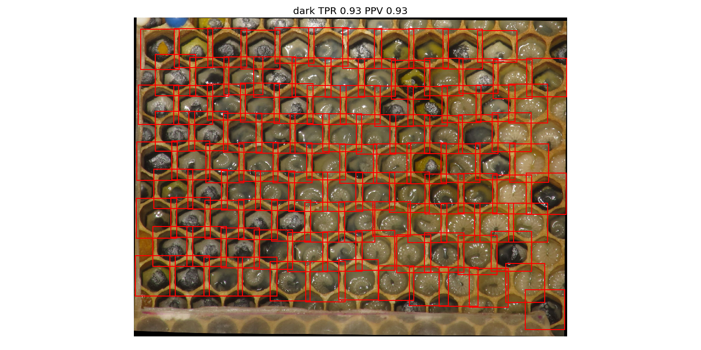
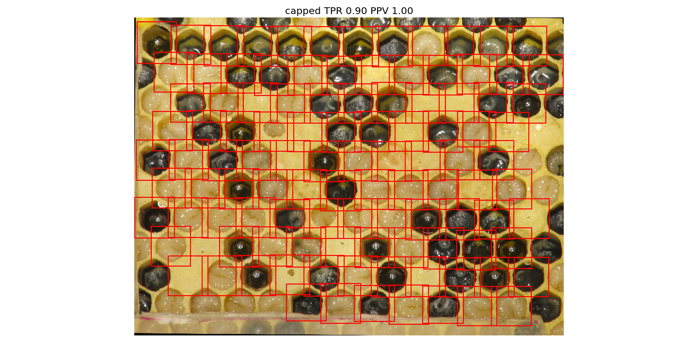

# Refine Segmentation

Here, I'm trying to make use of the repetitive nature of the honeycomb.
I'm first combining the [simple_gradient](../simple_gradient/) and [local_thresholding](../local_thresholding/) approaches from
earlier to create an initial segmentation.
Then, I'm using this initial segmentation to learn the pattern of the honeycomb
itself and then apply it, predicting new cells.

For the second step, I use the fact that the cells usually have 6 sides.
The angles of those 6 sides should be constant across the whole honeycomb.
By looking at only the closest neighbors (excluding outliers)
I should only see directly neighboring cells.
So, from the vectors of their centroids I can extract these 6 angles.

With these angles at hand I can look at every identified cell and
predict where its 6 neighbor cells should be.
Taking some uncertainty into considerations I can add a neighbor if
it was not identified initially.

By repeating this process several times I can also identify cells
which are not even direct neighbors of the initially identified cells.
To remove cells which are identified several times I also added a few clean-up procedures.
The most substantial one consolidates all segments which overlap a lot.

As always a _normal_ image first:

The dark image was a for some methods.
This one looks good:

The _capped_ image was the main reason for this method.
The other methods had no chance of detecting capped cells.
As you can see below, this method also identifies capped cells.

## Validation

For validation I use some images which I randomly picked from broodmapper.com
(under [../data/broodmapper/](../data/broodmapper)).
All cells in the honeycomb images are labeled by hand.
The validation algorithm checks whether each labeled cell is fully captured by
a segment of the segmentation.
From that TPR and PPV are calculated.
This is done in [test_procedure.py](./test_procedure.py), segmentations are shown
in [segmentations/](./segmentations/), statistics are in [results.json](./results.json).
