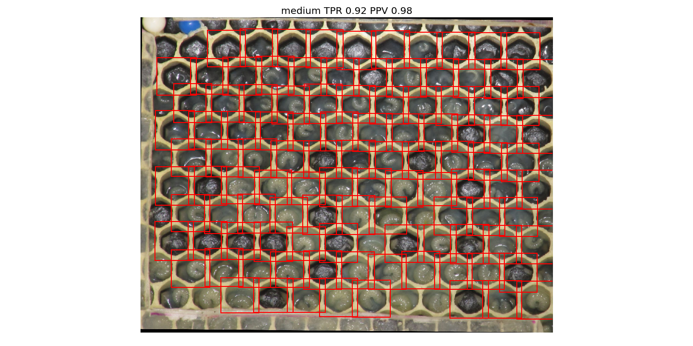
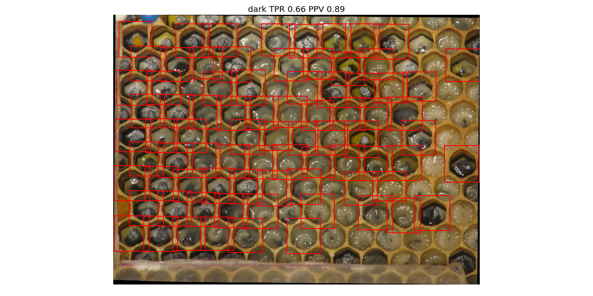
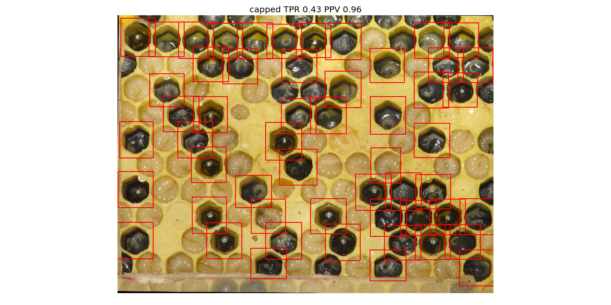

# Simple Gradient

Since mere thresholding was not good on the dark image and very bright cells, I tried a simple gradient-based approach.
The image gradient is computed and labels extracted using a threshold based on Otsu.
From the labels regions are extracted if they fit certain criteria similar to the thresholding method used before.
The procedure is in [procedure.py](./procedure.py).
On _normal_ images is works good:

The dark image was a problem before.
This method finds a much more cells than simple thresholding.

The _capped_ image is still a problem.
Caps cannot be found this way and even a lot of big larva are not found.

## Validation

For validation I use some images which I randomly picked from broodmapper.com
(under [../data/broodmapper/](../data/broodmapper)).
All cells in the honeycomb images are labeled by hand.
The validation algorithm checks whether each labeled cell is fully captured by
a segment of the segmentation.
From that TPR and PPV are calculated.
This is done in [test_procedure.py](./test_procedure.py), segmentations are shown
in [segmentations/](./segmentations/), statistics are in [results.json](./results.json).
