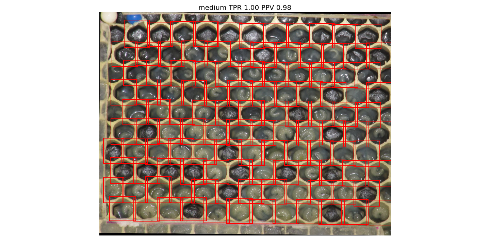
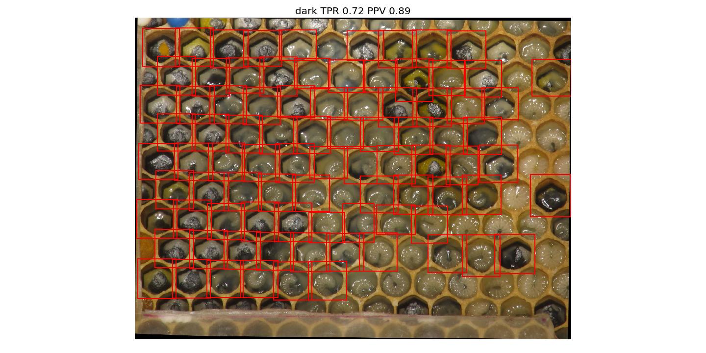
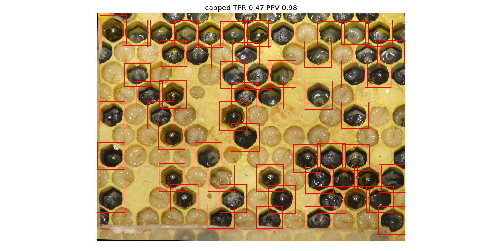

# Simple Thresholding

First, approach using simple thrsholding with Otsu to segment honeycomb.
It worked quite well with some adjustments as shown below.
The procedure is in [procedure.py](./procedure.py).

Otsu worked quite well except for darker honeycomb images.
With quite coarse median denoising followed by contrast stretching however,
Otsu found good thresholds.
I tried to use morphology based closing/opening and black/white tophat for
both finding labels and/or refining labels but it didn't improve the segmentation.
This is the result on a dark image.

A general problem this method has, is that it doesn't find bright cells
such as capped cells or cells with large larva inside.
The problem is shown below.

## Validation

For validation I use some images which I randomly picked from broodmapper.com
(under [../data/broodmapper/](../data/broodmapper)).
All cells in the honeycomb images are labeled by hand.
The validation algorithm checks whether each labeled cell is fully captured by
a segment of the segmentation.
From that TPR and PPV are calculated.
This is done in [test_procedure.py](./test_procedure.py), segmentations are shown
in [segmentations/](./segmentations/), statistics are in [results.json](./results.json).
