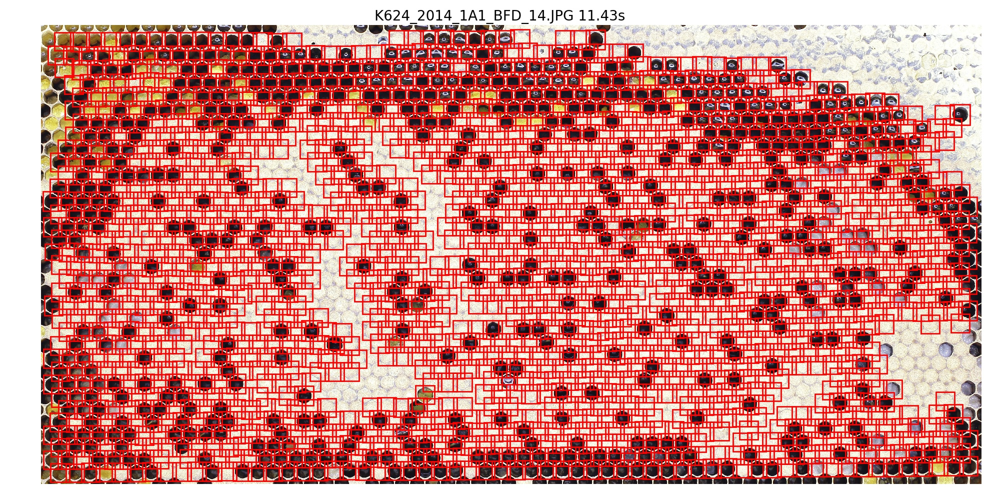

# Segmentation Test

Here, I'm applying the segmentation methods that I tried out on Broodmapper images on new images.
Stuff I noticed:

- **Sizes** The images are much bigger (~5600x3700), but cells are smaller (~100x100)
- **Number of Cells** There are much more cells (a few thousand per picture)
- **Capped Neighbors** There can be many neighboring _capped_ cells.
- **Image Background** Parts of the image are not the honeycomb but just the background of the photocell where the image was taken
- **Honeycomb Border** Close to the border of the honeycomb, cells seem broken or distorted.

Consequences:

- **Segmentation Parameters** Adjust the size of expected segments which are caputured during the initial segmentation.
- **White Tophat** As the gradient peaks of cells are very close together, they _touch_ quite often. Thus, the gradient of both cells is identified as one large segment (covering both cells). To prevent that from happening, I apply morphological erosion and expansion after computing the gradient.
- **Optimize/Parallelize** With the number of cells, the number of predicted vectors and segments increases in a quadratic way. So, performance of certain functions becomes an issue. I tried to optimize and parallelize.
- **Crop Image** The image background has to be removed in order for the histogram-based methods to work. I also decided to add a 10% padding to remove the distorted cells at the border. They don't seem to be used by the bees anyways.

For the problem of many neighboring _capped_ cells I don't really have a solution yet. My current refinement method captures unidentified cells neighboring to identified cells. By applying it multiple times I can also identify cells further away from the initially identified cell.

However, this method has a certain variance. Every time it's applied the variance adds up. I'm currently using only 2 rounds. With 3 rounds or more, I can identify more noighboring _capped_ cells, but some segments are bullshit.

Example:

Segmentation images are under [segmentations/](./segmentations/).
Segments (single cell images) are written to [segments/](./segments/).
They were manually labeled afterwards.
